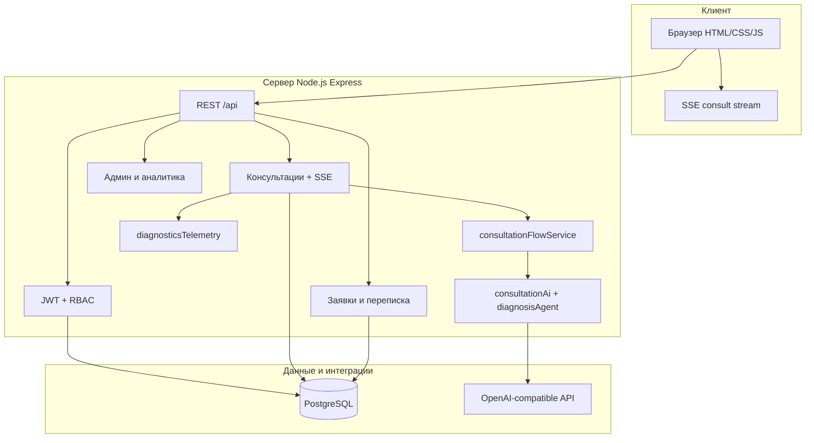

# Архитектура Fox Motors — AI Auto Service

## Обзор

Клиент-серверное веб-приложение: статический фронтенд, REST API на Node.js, PostgreSQL, интеллектуальный модуль на **облачном** OpenAI-compatible API (VseLLM).

## Структура репозитория

| Путь | Назначение |
|------|------------|
| `frontend/` | Публичные страницы, `consult.html`, дашборды ролей |
| `backend/src/app.js` | Express, middleware, статика frontend |
| `backend/src/routes/api.js` | Монтирование модулей `/api/*` |
| `backend/src/modules/` | auth, consultations, serviceRequests, admin, analytics, bookings |
| `backend/src/services/` | llmService, consultationFlowService, diagnosisAgent, diagnosticsTelemetry, consultationIntent |
| `backend/src/config/` | consultationFlow.config, env (feature flags) |
| `backend/src/lib/` | diagnosticPlaybooks, pricing, workStats, pdfCyrillicFont |
| `backend/prisma/` | schema, migrations, seed |
| `specs/001-ai-consultation-platform/` | ТЗ, OpenAPI, data-model |

## Поток консультации

Режим по умолчанию: `CONSULTATION_FLOW_MODE=llm_first` (см. `backend/.env.example`).

1. Клиент/гость отправляет сообщения → `POST /api/consultations/:id/messages` или **SSE** `GET /api/consultations/:id/messages/stream` (прогрессивная выдача ответа).
2. `consultationIntent` определяет намерение: диагностика / плановое обслуживание / неизвестно.
3. Сервер извлекает 6 полей (марка, модель, год, пробег, симптомы, условия) — rule-based + LLM-extraction при `llm_first`.
4. При полноте данных:
   - **Fast path** (`DIAGNOSIS_FAST_PATH_ENABLED`) — один вызов LLM для простых кейсов;
   - **LLMFactory-агент** (`DIAGNOSIS_AGENT_MODE=llmfactory`) — цепочка шагов: context → hypotheses → checks → reasoning → summary → final (JSON schema на каждом шаге);
   - классический hybrid — `preAnalyzeSymptoms` + LLM + `mergeDiagnosis`.
5. Бюджет хода: `DIAGNOSIS_TURN_BUDGET_MS` (типично 20–70 с); при нехватке времени — детерминированный fallback без зависания запроса.
6. При недоступности LLM (FR-025b) — rule-based без падения сессии.
7. Завершение → отчёт (PDF с кириллицей), `POST /api/service-requests` (клиент или гость).

### Feature flags (диагностика)

| Переменная | Назначение |
|------------|------------|
| `CONSULTATION_FLOW_MODE` | `llm_first` \| `hybrid` |
| `DIAGNOSIS_MODE` | `llm_only` \| `hybrid` |
| `DIAGNOSIS_AGENT_MODE` | `llmfactory` \| `classic` |
| `DIAGNOSIS_AGENT_PROFILE` | `compact` \| `full` |
| `DIAGNOSIS_FAST_PATH_ENABLED` | ускорение простых обращений |
| `DIAGNOSIS_TURN_BUDGET_MS` | лимит времени на один ход диалога |

## Наблюдаемость ИИ

- `GET /api/health/ai-diagnostics` — p50/p95/p99 латентности, счётчики fallback/ошибок/предотвращения циклов уточнений.
- `GET /api/health/ai-diagnostics/gates` — пороги для rollout/rollback по телеметрии.

## Роли (RBAC)

| Роль | Основные эндпоинты |
|------|-------------------|
| CLIENT | consultations, own requests, bookings, profile |
| MANAGER | all service-requests, messages, bookings list |
| ADMINISTRATOR | `/api/admin/*`, `/api/analytics/*` |

## Публичная витрина

Помимо консультации: `services.html`, `book-service.html` (запись без аккаунта), `works.html`, `gallery.html`, `location.html`, `about.html`.

## Развёртывание

| Среда | Документ |
|-------|----------|
| Локально | [setup.md](./setup.md) — `docker compose` + `npm run dev` |
| Production self-host | [proxmox-selfhost.md](./proxmox-selfhost.md) — VM, Nginx+TLS, systemd |
| LLM | Облако VseLLM (`LLM_CLOUD_BASE_URL`, `LLM_API_KEY`, `LLM_MODEL`) в `backend/.env` |

## Связанные документы

- [setup.md](./setup.md) — установка
- [testing.md](./testing.md) — тесты
- [manual-acceptance-tr007.md](./manual-acceptance-tr007.md) — TR-007
- [specs/001-ai-consultation-platform/contracts/openapi.yaml](../specs/001-ai-consultation-platform/contracts/openapi.yaml) — REST API
