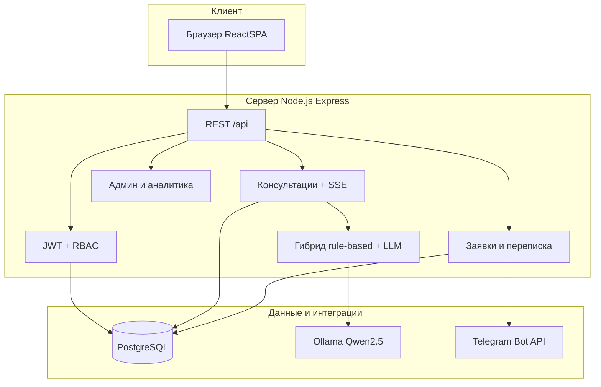

# Архитектура интеллектуального ассистента автосервиса

## Обзор

Клиент-серверное веб-приложение: React SPA (Vite), REST API на Node.js, PostgreSQL, локальная или облачная LLM, опционально Telegram для менеджеров.

## Структура репозитория

| Путь | Назначение |
|------|------------|
| `frontend/src/` | React SPA: публичные страницы, консультация, кабинеты ролей |
| `backend/src/app.js` | Express, middleware, статика frontend |
| `backend/src/routes/api.js` | Монтирование модулей `/api/*` |
| `backend/src/modules/` | auth, consultations, serviceRequests, admin, analytics, bookings |
| `backend/src/services/` | ollamaService, consultationFlowService, caseMemory |
| `backend/src/lib/` | diagnosticPlaybooks, pricing, workStats |
| `backend/prisma/` | schema, migrations, seed |
| `specs/001-ai-consultation-platform/` | ТЗ, OpenAPI, data-model |

## Поток консультации

1. Клиент/гость отправляет сообщения → `POST /api/consultations/:id/messages`.
2. Сервер извлекает 6 полей (марка, модель, год, пробег, симптомы, условия).
3. При полноте — `preAnalyzeSymptoms` + запрос к Ollama (JSON schema) → `mergeDiagnosis`.
4. При недоступности LLM (FR-025b) — fallback на rule-based без падения сессии.
5. Завершение → отчёт, `POST /api/service-requests` (клиент или гость).

## Роли (RBAC)

| Роль | Основные эндпоинты |
|------|-------------------|
| CLIENT | consultations, own requests, bookings, profile |
| MANAGER | all service-requests, messages, bookings list |
| ADMINISTRATOR | `/api/admin/*`, `/api/analytics/*` |

## Развёртывание

Локально: `docker compose` (Postgres + Ollama) + `npm run dev` (frontend + backend).  
Подробности: [ONBOARDING.md](./ONBOARDING.md).

## Связанные документы

- [ONBOARDING.md](./ONBOARDING.md) — установка и запуск
- [testing.md](./testing.md) — тесты
- [manual-acceptance-tr007.md](./manual-acceptance-tr007.md) — TR-007
- [demo-defense.md](./demo-defense.md) — демо-сценарий
- [specs/001-ai-consultation-platform/contracts/openapi.yaml](../specs/001-ai-consultation-platform/contracts/openapi.yaml) — REST API
