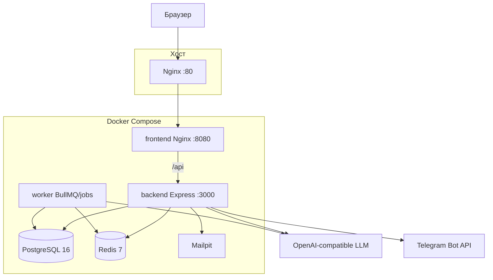

# Архитектура

Клиент-серверное веб-приложение: React SPA, REST API на Express, PostgreSQL, Redis, LLM (облако или Ollama), опционально Telegram и SMTP.

В development Vite (`:5173`) проксирует `/api` на backend `:3000`. В production frontend-контейнер сам проксирует `/api` на `backend:3000`.

## Стек

| Слой | Технологии |
|------|------------|
| UI | React 19, Vite 7, TypeScript, React Router 7 |
| API | Node.js 22, Express 4, TypeScript (tsx), Prisma 6 |
| Данные | PostgreSQL 16 + pgvector (HNSW cosine на case memory) |
| Очередь диагноза | BullMQ + Redis 7 (AOF); worker-контейнер (`src/worker.ts` через tsx), API с `RUN_BACKGROUND_JOBS=false` |
| Наблюдаемость | Pino + `trace_id`, Prometheus `/api/metrics`, OpenTelemetry SDK (OTLP если задан `OTEL_EXPORTER_OTLP_ENDPOINT`) |
| Auth | JWT в httpOnly-cookie + CSRF double-submit |
| ИИ | `ollamaService.ts` → Ollama native или OpenAI-compatible |

## Репозиторий

| Путь | Назначение |
|------|------------|
| `frontend/src/pages/public/` | Лендинг, услуги, консультация, запись |
| `frontend/src/pages/dashboards/client/` | Кабинет клиента |
| `frontend/src/pages/manager/` | Кабинет менеджера (админ переиспользует с `adminZone`) |
| `frontend/src/pages/admin/` | Пульт, ИИ-студия, CMS, интеграции |
| `frontend/src/config/dashboardNav.ts` | Навигация ролей |
| `backend/src/app.ts` | Express, helmet, CORS, CSRF, статика |
| `backend/src/routes/api.ts` | Монтирование `/api/*` |
| `backend/src/modules/` | auth, consultations, serviceRequests, bookings, admin, analytics, integrations, … |
| `backend/src/services/` | LLM, consultation flow, case memory, vision, очередь диагноза |
| `backend/src/worker.ts` | Отдельный процесс: диагноз BullMQ, outbox drain, SLA, reminders, guest TTL |
| `frontend/src/styles/` | CSS: `app/tokens.css` + `app/base.css` + feature-файлы кабинета; лендинг — `site/*.css` |
| `backend/src/prompts/` | Промпты и JSON-схемы консультации |
| `backend/prisma/` | schema, migrations, seed |
| `deploy/` | Nginx, systemd, бэкапы |
| `tests/e2e/` | Playwright |

## Auth и безопасность

- Access/refresh JWT в cookie `car_service_at` / `car_service_rt` (httpOnly, SameSite=Lax).
- CSRF: cookie `car_service_csrf` + заголовок `X-CSRF-Token` на мутациях с сессией.
- RBAC: `CLIENT`, `MANAGER`, `ADMINISTRATOR`. Зоны кабинета режутся в роутере (`dashboardPaths.ts`).
- Rate limit на логин и публичные записи консультации.
- Пароли: политика сложности + bcrypt.

Гость может пройти консультацию и создать заявку без аккаунта; после регистрации/входа сессия и заявка **claim**-ятся на профиль.

## Поток ИИ-консультации

1. `POST /api/consultations` — сессия клиента или гостя (`guestToken`).
2. Сообщения → `POST /api/consultations/:id/messages`.
3. Сценарий собирает поля: марка, модель, год, пробег, симптомы, условия (плюс OBD и фото, если есть).
4. Extraction (лёгкая модель) → при полноте диагноз (тяжёлая модель, JSON schema).
5. Похожие кейсы: семантическая память (`caseMemory.service.js`) + лексический fallback.
6. Merge с rule-based слоем; при недоступности LLM сессия не падает.
7. Опционально async-диагноз через BullMQ (`DIAGNOSIS_ASYNC_ENABLED`).
8. Заявка: `POST /api/service-requests` или гостевой эндпоинт; запись — `/api/bookings`.

Менеджер оценивает диагноз (верный / частично / нет) → `ConsultationFeedback` → метрики и few-shot в промпт.

## Модули API (`/api`)

| Префикс | Ответственность |
|---------|-----------------|
| `/live`, `/ready`, `/health` | liveness / readiness (БД+Redis) |
| `/metrics` | Prometheus text |
| `/product-events` | События воронки (consult_started, diagnosis_shown, …) |
| `/auth` | Регистрация, логин, OTP, refresh, сброс пароля, верификация email |
| `/consultations` | Сессии, стрим, отчёты, claim, PDF |
| `/service-requests` | Заявки, статусы, PDF |
| `/service-requests/:id/messages` | Переписка и вложения |
| `/bookings` | Записи клиента, гостя, календарь |
| `/users`, `/vehicles` | Профиль, гараж, сервисная книжка |
| `/contact` | Обращения с сайта |
| `/content` | Публичный контент и white-label |
| `/admin` | Пользователи, CMS, ИИ, интеграции, аудит |
| `/analytics` | KPI, воронка, качество ИИ |
| `/webhooks` | Входящие вебхуки CRM |

Контракт OpenAPI 0.5.0 в `specs/…/contracts/openapi.yaml` покрывает все path+method из инвентаря (схемы тел — минимальные). Проверка дрейфа: `npm run routes:check` и `npm run openapi:check`.

Публичные POST (контакт, запись, создание консультации) принимают заголовок `Idempotency-Key`. Outbox CRM дренируется фоновым poller (`outboxDrain.job.js`), не на hot path HTTP.

## Данные

Источник схемы: `backend/prisma/schema.prisma`. Помимо ядра консультации там же CMS (`SiteSettings`, блоки, галерея), интеграции CRM, feedback, embeddings кейсов (JSON + колонка `embedding_vec` / pgvector HNSW), OTP, документы завершения работ. Образ БД: `docker/postgres` (Alpine 16 + pgvector 0.8.1), чтобы том `pgdata` оставался совместимым.

## Связанные документы

- [ONBOARDING.md](./ONBOARDING.md) — запуск
- [product.md](./product.md) — экраны ролей
- [testing.md](./testing.md) — тесты
- [deploy.md](./deploy.md) — прод и демо-хост
